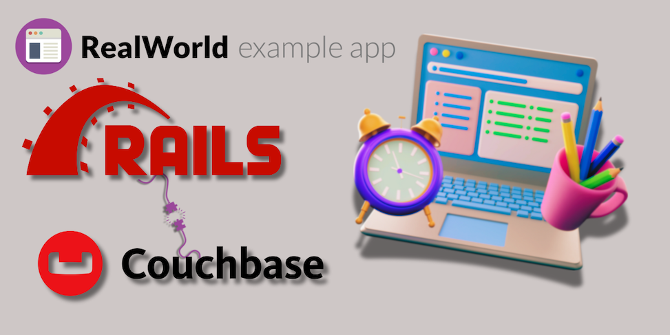

# 


[](/LICENSE)


> ### Ruby on Rails codebase containing real world examples (CRUD, auth, advanced patterns, etc) that adheres to the [RealWorld](https://github.com/gothinkster/realworld) spec and API.

## What is RealWorld?

See how the *exact* same Medium.com clone (called Conduit) is built using any of our supported frontends and backends. Yes, you can mix and match them, because they all adhere to the same [API spec](https://realworld-docs.netlify.app/docs/specs/backend-specs/introduction). 😮😎

While most "todo" demos provide an excellent cursory glance at a framework's capabilities, they typically don't convey the knowledge & perspective required to actually build _real_ applications with it.

**RealWorld** solves this by allowing you to choose any frontend (React, Angular, & more) and any backend (Node, Django, & more) and see how they power a real-world, beautifully designed full-stack app called [**Conduit**](https://conduit.realworld.how).

_Read the [full blog post announcing RealWorld on Medium.](https://medium.com/@ericsimons/introducing-realworld-6016654d36b5)_

Join us on [GitHub Discussions!](https://github.com/gothinkster/realworld/discussions) 🎉

### [Demo](https://demo.realworld.io/)&nbsp;&nbsp;&nbsp;&nbsp;[RealWorld](https://github.com/gothinkster/realworld)

## Ruby on Rails + Couchbase RealWorld example

This codebase was created to demonstrate a fully fledged fullstack application built with Ruby on Rails with Couchbase including CRUD operations, authentication, routing, pagination, and more.

We've gone to great lengths to adhere to the Ruby on Rails community styleguides & best practices.

For more information on how to this works with other frontends/backends, head over to the [RealWorld](https://github.com/gothinkster/realworld) repo.

### Architecture Overview

The general architecture of this RealWorld implementation is as follows:

1. Rails MVC Framework:

* The application follows the Model-View-Controller (MVC) architecture provided by Ruby on Rails. This structure helps in organizing the codebase in a maintainable and scalable way.
* Models represent the application's data and business logic.
* Views are used to present data to the user.
* Controllers handle incoming requests, interact with models, and render the appropriate views or JSON responses.

2. Couchbase as the Database:

* The application uses Couchbase, a NoSQL database, for storing data. Couchbase is known for its flexibility, scalability, and high performance.
* N1QL (SQL for JSON) queries are used to interact with Couchbase, making it easier to perform complex queries and operations on the data.
* The application includes a mock for Couchbase to facilitate testing without interacting with the production database.

3. JWT Authentication:

* User authentication is implemented using JSON Web Tokens (JWT). This provides a stateless and secure method for authenticating users.
* Tokens are issued during login and are used to authenticate subsequent requests.

4. RESTful API:

* The application exposes a RESTful API that adheres to the RealWorld specification. This includes endpoints for managing users, profiles, articles, comments, and tags.
* The API supports common operations like create, read, update, and delete (CRUD), and also includes additional functionality like favoriting articles and following users.

5. Routing:

* Rails routing is used to map incoming requests to the appropriate controller actions. The routes are defined in the config/routes.rb file.
* Namespaced routes are used for the API endpoints, ensuring clear separation between different parts of the application.

6. Controllers and Actions:

* User Controller: Handles user registration, login, profile management, and authentication.
* Article Controller: Manages CRUD operations for articles, including creating, updating, deleting, and retrieving articles.
* Comment Controller: Manages comments on articles, including adding and deleting comments.
* Tag Controller: Handles retrieving tags associated with articles.
* Profile Controller: Manages user profiles, including following and unfollowing users.

7. Error Handling:

* The application includes comprehensive error handling to ensure that appropriate error messages are returned for different scenarios, such as invalid data, unauthorized actions, and resource not found.

8. Testing:

* The application is tested using RSpec, a popular testing framework for Ruby. Tests cover models, controllers, and request specs to ensure the application's functionality and reliability.
* Mocks and stubs are used to simulate interactions with Couchbase during tests, allowing for isolated and faster test execution.

9. Documentation and Best Practices:

* The codebase adheres to Ruby on Rails community style guides and best practices, ensuring readability, maintainability, and consistency.
* Comments and documentation are included throughout the codebase to explain key concepts and implementation details.

### Getting started

Follow these steps to get the RealWorld Ruby on Rails application up and running on your local machine.

**Prerequisites**

Make sure you have the following installed:

* Ruby 3.3.x
* Bundler
* Rails 7.0.x
* Git

You will also need an account on Couchbase Capella to create a cluster and obtain the connection details.

**Clone the repository**

```bash
git clone https://github.com/hummusonrails/realworld-yew.git
cd realworld-yew
```

**Install dependencies**

```bash
bundle install
```

**Configure Couchbase Credentials**

Create a `.env` file in the root directory of the project and add the following environment variables:

```bash
COUCHBASE_USERNAME=your_couchbase_username
COUCHBASE_PASSWORD=your_couchbase_password
COUCHBASE_URL=your_couchbase_connection_string_url
COUCHBASE_BUCKET=your_couchbase_bucket
```

You can obtain those credentials by first creating an account on Couchbase Capella at [https://cloud.couchbase.com/](https://cloud.couchbase.com/) and then creating a database called `RealWorldRails`. Inside the database, create a bucket. The name of the bucket is what you should use for the `COUCHBASE_BUCKET` environment variable.

Once you have done so, you can navigate to the `Connect` tab in the database and copy the connection string URL. This is what you should use for the `COUCHBASE_URL` environment variable. You will also need to create a user with the appropriate permissions and use the username and password for the `COUCHBASE_USERNAME` and `COUCHBASE_PASSWORD` environment variables.

**Running the Test Suite**

This application includes a comprehensive test suite that covers models, controllers, and request specs. To run the test suite, use the following command:

```bash
bundle exec rspec
```

This will run all the tests and output the results in the terminal. You can run any specific test file by passing the file path as an argument to the `rspec` command, as follows:

```bash
bundle exec rspec spec/models/user_spec.rb
```

**Starting the Application**

To start the application, run the following command:

```bash
bundle exec rails server
```

This will start the Rails server, and you can access the application at [http://localhost:3000](http://localhost:3000).

### API Endpoints

The application exposes the following API endpoints that adhere to the RealWorld specification. Here are a few examples:

* `GET /api/articles`: Get a list of articles.
* `POST /api/articles`: Create a new article.
* `GET /api/articles/:slug`: Get a specific article by slug.
* `PUT /api/articles/:slug`: Update an article by slug.
* `DELETE /api/articles/:slug`: Delete an article by slug.
* `POST /api/articles/:slug/comments`: Add a comment to an article.
* `DELETE /api/articles/:slug/comments/:id`: Delete a comment by id.
* `POST /api/articles/:slug/favorite`: Favorite an article.
* `DELETE /api/articles/:slug/favorite`: Unfavorite an article.
* `GET /api/tags`: Get a list of tags.

For a complete list of API endpoints and examples, refer to the [RealWorld API Spec](https://realworld-docs.netlify.app/docs/specs/backend-specs/introduction).

### Contributing

Contributions are more than welcome! If you encounter any bugs or issues with the application, please open an issue on the GitHub repository. If you would like to contribute code, feel free to open a pull request with your changes. All contributors are expected to follow the [Code of Conduct](CODE_OF_CONDUCT.md).

### License

This project is licensed under the MIT License - see the [LICENSE](LICENSE) file for details.